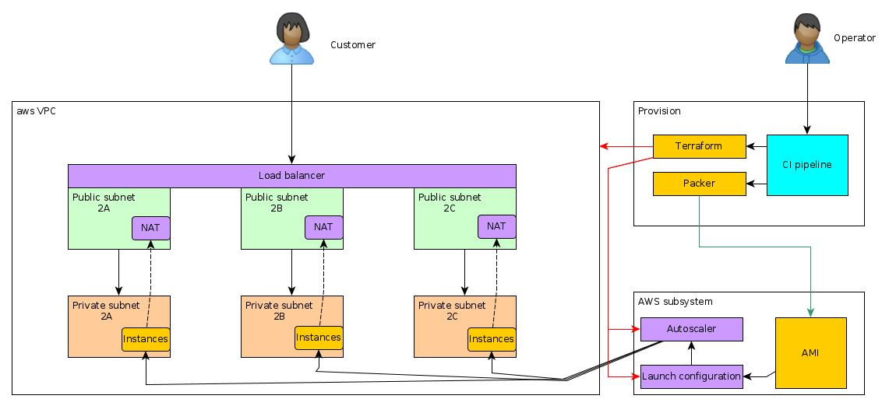

# Proof of Concept (PoC) Terraform aws web cluster

## To action!
I just want to get  [started](#by-docker)

# Preface
This PoC creates a php application on a AWS platform with multi AZ and autoscaling. 

Though the assignment is simple terraform script, this script is not really of value without being part of a deployment pipeline. On a senior level this pipeline needs to be placed in context to show the value of the script. 
So it has been decided to place the terraform script in a pipeline.  
Goals are:  
- Show the added value of a pipeline. 
- Create a PoC that can be used outside training exercises. 
- Trigger a discussion of value and business processes as a result of this PoS 
- Showcase ask nicely what modern technologies can deliver in a short time. 

Out of scope are:  
- Any type of normal corroboration with the team or customer to establish this adds value to them and / or the team. 
- Code reviews and pull requests as normal within a software development team.  
- Any type of terraform state persistence. All is local state. 
- Limited use of SCM backed terraform modules to keep all code together. 
- Security in IAM , restrictions only as stipulated in the assignment. 
- CI other than an bash pipeline.
- SSL certificates and HTTPS
- Git signing of commits 

Notes: 
- The terraform scripts make use of existing modules and are wrapped in a module as well.
- The project can be run in several ways, the easist is through the docker containers that only need docker to be installed in the system. 
- This document will start with a preface and then the quick starts. After that there are more   

Licence:  
This software is licensed, before use please assess this fits your business-case. 


Requirements of the core project; 

```
Write a Terraform resource that launches:

- [check] A VPC. This should include a subnet, route table, and internet gateway.
- [check] An EC2 instance, running a web server that serves a page with the content of your choice. This can be an AWS Free Tier instance, and based off a free tier image.
- [check] An Application Load Balancer targeting the EC2 instance.

This task will require the use of Terraform and the AWS provider. Feel free to use other providers as you see fit.

We use Terraform version 0.11, but use whatever version you are comfortable with.

Make sure that you are running an appropriate `.gitignore` file that excludes your Terraform state. We recommend [https://github.com/github/gitignore/blob/master/Terraform.gitignore](https://github.com/github/gitignore/blob/master/Terraform.gitignore)

What are we looking for?

- [check] Resources should be contained within the VPC
- [check] EC2 instances should not be directly publicly accessible by HTTP/HTTPS (You should be able to access web server content via the Load Balancer.)
- [check] Resources should be well named, well structured and logically separated. It's good to have use of modules and input/output variables when appropriate.

Extra Tasks:

- [check] Ports available on Load Balancers and EC2 instances should be limited to only the necessary ports
- [check] It should be possible to adjust the number of EC2 instances by only changing a variable
 
How to submit your work?

- Commit your Terraform project as a Github repo.
- Include a README.md that explains the intended way of executing the terraform plan, and how to access the content of your web server(s).
- Send us a link to your Github repository for the Terraform project.
```

# Strategy 

This project is a proof of skill for the use as terraform as a Infra as Code example. All parts of this project will be coded (except this readme, the license file and the initial .gitignore file which were generated by github project creation. And the project-template folder that will hold the generation code for the rest of the project) so it should be completely reproducible from code. 

# Architecture 

Architecural decisions are placed in the docs/doc/adr folder in the form of [Architecture Decision Records](https://github.com/joelparkerhenderson/architecture_decision_record) 

A diagram of the envisioned architecture:  

 

# Implementation 

## Technology stack
**Primary technology**
- Terraform 0.12.13  

**Ancillary technology**
- Linux - Gnome 3.34
- Bash 5.0 
- Docker 19.03 (For the easy-quickstart, you would not need the other requirements anymore below this one)
- IntelliJ 2019.2.4  
- Ansible 2.9.0 
- [ADR-tools](https://github.com/npryce/adr-tools/releases/tag/3.0.0)  
- Packer 1.4.1
- [AWS-Vault](https://github.com/99designs/aws-vault)

## Prerequisites
- Docker installed   
-- OR --
- AWS account with admin rights 
- AWS key and secret to the admin account
- Configure the .aws/credentials file as we use this in the terraform script, create the `private` profile 
- Linux machine or VM 
- Installed the technology stack. 
- Internet connection (no proxy)
- Register yourself for use of the `ami-0f42adcde7bd302ce`AMI [here](aws-marketplace/CentOS 8 LEMP Stack - Linux Nginx MySQL/MariaDB PHP 7.2-4c9ced57-677c-4dff-b708-e91c27f3fd7b-ami-042144ca63e136136.4) 

## Flow 
The readme will continue with the flow as follows:
- Pre: Setup and project generation 
- CI : Source image creation 
- Provision : Infrastructure and deployment
- The pipeline, go with the flow

---

## TL;DR Quick start

There is an easy and and a little more involved quick way to run the stack.
One is to encapsulate most of the requirements by docker so you do not need to set up much, the other is having aws-vault, packer and terraform installed on your system and run that. 

By Docker is the easy way to do as you only need docker, the aws-vault needs the rest of the prereqs.  

---

### By docker 

#### Build image
For this you only need (linux) docker and aws key and secret as well as an aws console account.   
You want to register the base image we use: 
This is a image with php and fastcgi installed. Get a subscription at aws-marketplace/CentOS 8 LEMP Stack - Linux Nginx MySQL/MariaDB PHP 7.2-4c9ced57-677c-4dff-b708-e91c27f3fd7b-ami-042144ca63e136136.4 (no costs except usage)  
Region is `ap-southeast-2`  
Now for the docker commands, we have two builders, `packer-builder` that creates the image and `terraform-builder` that deploys the infrastructure.   


from `ci/packer-builder`
set the env values for AWS_ACCESS_KEY_ID and AWS_SECRET_ACCESS_KEY with your aws key and secret
```bash 
export AWS_ACCESS_KEY_ID=<yourkeyhere>
export AWS_SECRET_ACCESS_KEY=<yoursecrethere>
```
Then run 
```bash
bash build-packer-builder.sh <version> > output.txt
#for instance 
bash build-packer-builder.sh 0.2.2 > output.txt
```
You need the output.txt for the next phase, the next docker build will pick that file up.

#### Deploy image and infrastructure
From the `ci/terraform-builder` folder run 

```bash 
bash build-terraform-builder.sh <Version> <number_of_instances> <Environment> 
#For instance
bash build-terraform-builder.sh 0.2.4 3 DEV
```
Param 1: Version to deploy, defaults to 0.0.0  
Param 2: Number of instances to deploy, defaults to 3  
Param 3: Environment to deploy to, one of DEV|UAT|PROD, defaults to DEV  

This will create a `terraform.tfstate` file you can use for altering or destroying the stack later. 
For this PoC  you need to copy the `terraform.tfstate` file to the infra folder of the env you were running from  
(for instance for DEV that would be infra/non-prod/dev) after that you can use it for 
altering and deleting the terraform stack. 

----

### By aws-vault 

You need to install the prequisites first to do the deployment this way.  
After installing and assuring the prerequisites.   
Go to the ci folder and run
```bash 
bash pipeline.sh 0.1.0 DEV true 6
```
Param 1 : Version to deploy, defaults to 0.0.0  
Param 2 : Environment to deploy to, one of 'DEV','UAT','PROD' defaults to 'DEV'   
Param 3 : Build AIM iso before deploying, needs to have a pipeline.sh with true run first. One of 'true', 'false', defaults to 'true'   
Param 4: Number of instances to be created by the autoscaler. Note that this number needs to be between the min and max number of instances defined in the main terraform files.

You can test build an AIM image and then deploy it to all environments by:
```bash
bash pipeline.sh 0.1.0 DEV true 3
bash pipeline.sh 0.1.0 UAT false 6
bash pipeline.sh 0.1.0 PROD false 9
```

And follow the deployment, note that you can follow the commands in the pipeline file to see how the process is working. This pipeline can easily run from Jenkins, Concourse, Circle CI or other CD/CI environment. 

The process will return the endpoint in the format: 
```text
Outputs:

loadbalancer_dns = lb-website-<$ENV>-557559432.ap-southeast-2.elb.amazonaws.com
```


# Details

This will explain the details of the solution and is only of interest for those who need changes made in how the PoC works or wants to know how the PoC is working.  


## Skeleton project generation. 
The start phase is the generation of the directory structure of the site. Projects should follow a standard pattern that makes automation over several projects easier.
This is from a template project, normally this would come from a template repo. For simplicity sake we have it integral in this project. 

Needs; Ansible, Bash

run as 

```bash 
cd project-template/
bash build-skeleton-project.sh

```

Produces : Standarized project to work from.   
Values: Reproducible, Standarized, Documented as code. 


## Build image with application 
This will create an AIM image that we use for the deployment of the app. 
Needs: Packer, bash 
In the CI folder it will build from the build-release.sh script as 
```bash
bash build-release.sh <version> 
# for instance
bash build-release.sh 0.1.0
```

Produces: An AIM image with the software backed in from a trusted template  
Values: Developers can work of a trusted image and deploy the same image to several environments. 

Note: The base image defined in the packer json script at `ci/website-builder.json` is : `ami-0f42adcde7bd302ce`. 

This is a image with php and fastcgi installed. Get a subscription at `aws-marketplace/CentOS 8 LEMP Stack - Linux Nginx MySQL/MariaDB PHP 7.2-4c9ced57-677c-4dff-b708-e91c27f3fd7b-ami-042144ca63e136136.4` (no costs except usage) 

## Run by Environment 
In the infra folder there are three definitions, `non-prod/dev`. `non-prod/uat`, and `prod`. 
For each of these environments there is a provision block assigning the account to run form, and a call to the terraform module in the terraform folder of the project.  
From each of the folders the terraform provision will work by: 

The `ami-0afc3beaf12bfacc6` is the value the build-release will have returned as the AMI. This will be different from here. 

Needs: Terraform

```bash
terraform init
terrafrorm plan -var "deploy_image_website=ami-0afc3beaf12bfacc6" -out env.plan
terraform apply env.plan
``` 

Produces: Infrastructure and the website running.  
Values: Guarantee of status of the platform. Platform as a service, Infrastructure as code

Deployment and infrastructure maintenance in one provision phase. Expandable over many environments.
On completion the terraform apply script returns the endpoint of the loadbalancer to see the application on. 

Parameters: 

| Name | Example |  External parameter | Description |
| --- | --- | --- | --- |
|vpc_name | "PoS UAT VPC" | no | Name the VPC will get
|  vpc_cidr | "10.2.0.0/21" | no | CIDR address of the VPC, needs to be private and cannot overlap other VPCs when plan to bridge to them. 
|  private_subnets | ["10.2.0.0/24","10.2.1.0/24","10.2.2.0/24"] | no | Needs to be inside the VPC range
|  public_subnets | ["10.2.3.0/24","10.2.4.0/24","10.2.5.0/24"] | no | Needs to be inside the VPC range 
|  enable_nat_gw | true | no | Allow instances to connect out to the internet
|  environment | "uat" | no | environment name the resources will be tagged with
|  region | var.aws_region | yes | Region to deploy to.
|  loadbalancer_name_prefix | "website-lb-uat" | no | Name of the loadbalancer
|  bucket_logging_name | "loadbalance-access-logging-uat" | no | Name of the logging bucket
|  deploy_image_website_instance_type | "t2.small" | no | AWS instance type
|  number_of_instances | var.number_of_instances| | yes | Number of instances that should run. (preferred number)
|  maximum_number_of_instances | 6 | no | Max of number of instances, needs to be greater or equal to the number of instances
|  minumum_number_of_instances | 3 | no | Min of number of instances, needs to be smaller or equal to the number of instances
|  deploy_image_website | var.deploy_image_website | yes  | AIM Image to deploy, needs to exist and permitted to be used
|  release_version| var.release_version | yes | Version of the release that is passed to the AIM

An external parameter is a parameter that can be passed into the terraform script by `-var`  

Note: This system tears down the autoscaler on a new deploy and creates a new one, causing a few minutes outage, there is way to have no outage by doing the instance replacement by hand in the autoscaler console on AWS or use AWS commandline. 


# Cleanup
Delete the resources by going in the `infra/<env>` folders and run
```bash
terraform destroy
```
